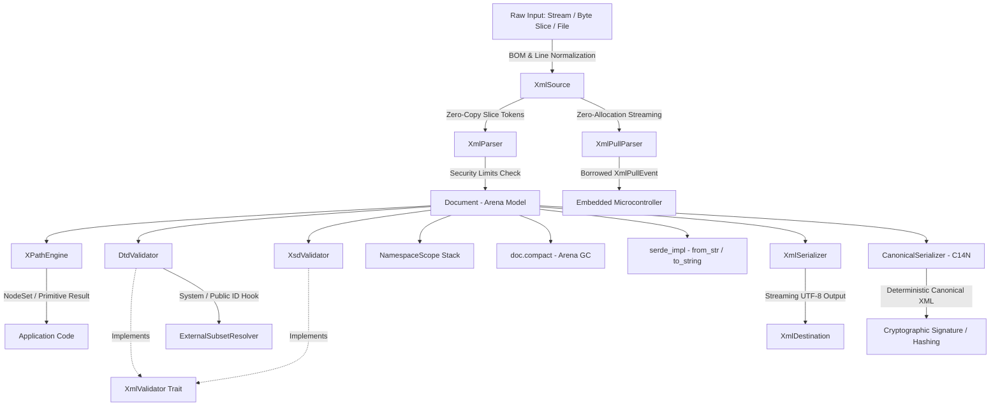

# Technical Architecture & Internal Design

This document details the internal design, memory layout, security enforcement model, SOLID trait abstractions, and embedded systems architecture of the `xml_lib` Rust crate.

For dedicated subsystem references, see:
- [XML Namespaces 1.0 Guide](NAMESPACES_GUIDE.md)
- [Canonical XML (C14N) Guide](CANONICALIZATION_C14N.md)
- [XPath 1.0 Query Engine Guide](XPATH_GUIDE.md)
- [DTD & XSD Schema Validation Guide](SCHEMA_VALIDATION.md)
- [Serde & Streaming I/O Guide](SERDE_AND_STREAMING.md)
- [Embedded & Microcontroller Guide](EMBEDDED_DEVELOPMENT.md)

---

## 1. System Overview & Data Flow



---

## 2. Flat Arena Memory Model (`Document`)

Unlike traditional object-oriented DOM libraries that use heap-allocated pointer graphs (`Rc<RefCell<Node>>` or `Box<Node>`), `xml_lib` stores all DOM nodes in a flat contiguous arena vector: `Vec<NodeData>`.

### Key Benefits

1. **Compact 32-Bit / 16-Bit Identifiers**: Every node is referenced by a `NodeId` (`u32` by default, or `u16` with feature `small_nodes`). Memory layout per node is reduced from 80 bytes to **32 bytes** (or **24 bytes** with `small_nodes`).
2. **CPU Cache Line Efficiency**: Continuous memory layout allows CPU prefetchers to load multiple adjacent nodes into L1/L2 cache lines simultaneously.
3. **No Reference Cycles or Lifetimes**: Node linking (`parent`, `children`) uses simple integer indices, avoiding memory leaks or complex borrow checker lifetimes.

### Node Data Memory Layout

```rust
// Standard mode: u32 (supports 4.2B nodes). small_nodes feature: u16 (supports 65.5K nodes).
#[cfg(not(feature = "small_nodes"))]
pub type NodeId = u32;

#[cfg(feature = "small_nodes")]
pub type NodeId = u16;

pub struct Attribute {
    pub name: Box<str>,   // 16 bytes (ptr + len)
    pub value: Box<str>,  // 16 bytes (ptr + len)
}

pub struct NodeData {
    pub id: NodeId,              // 4 bytes (or 2 bytes)
    pub parent: Option<NodeId>,  // 8 bytes (or 4 bytes)
    pub children: Vec<NodeId>,   // 24 bytes
    pub kind: NodeKind,          // Tag payload variant
}
```

---

## 3. SOLID Trait Abstraction (`XmlValidator`)

To adhere to the Open/Closed Principle (OCP), Liskov Substitution Principle (LSP), and Dependency Inversion Principle (DIP), all document validation engines implement the abstract [`XmlValidator`](SCHEMA_VALIDATION.md#1-the-unified-xmlvalidator-trait) trait:

```rust
pub trait XmlValidator {
    fn validate(&self, doc: &Document) -> Result<()>;
}
```

### Implemented By
- `DtdValidator`: Validates DTD internal subset content models (`<!ELEMENT>`), required attributes, and ID/IDREF referential integrity.
- `XsdValidator`: Validates W3C XML Schema definitions (`xs:schema`), element sequences, choices, and restriction facets.
- **Custom User Validators**: Applications can define custom schema or business rule validators and use them as trait objects (`&dyn XmlValidator`).

---

## 4. Embedded Systems & Bare-Metal Architecture (`#![no_std]`)

For microcontrollers and bare-metal environments (Cortex-M, ESP32, RISC-V):

1. **`#![no_std]` + `alloc` Support**: When standard library integration is disabled (`default-features = false, features = ["alloc"]`), `xml_lib` compiles under `#![no_std]` using `alloc::vec::Vec`, `alloc::string::String`, and `alloc::collections::BTreeMap`.
2. **Zero-Allocation Streaming Pull Parser (`XmlPullParser`)**: SAX-style streaming reader that emits borrowed events (`XmlPullEvent<'a>`) over a raw byte/string slice with zero heap allocation (`no_alloc`).
3. **16-Bit Compact Arena (`small_nodes`)**: Cuts node index overhead down to 16 bits (`u16`), saving an additional 25% RAM per node.

See the [Embedded Development Guide](EMBEDDED_DEVELOPMENT.md) for architecture-specific configurations.

---

## 5. Security Policy & XXE Safeguards (`ParseOptions`)

To defend against XML Denial of Service (DoS) and XML External Entity (XXE) attacks, `xml_lib` enforces strict resource thresholds at runtime via `ParseOptions`:

```rust
pub struct ParseOptions {
    pub max_xml_size: usize,               // Default: 100 MB
    pub max_entity_expansion_depth: usize, // Default: 512 (Billion Laughs Guard)
    pub max_nesting_depth: usize,          // Default: 1000
    pub max_element_count: usize,          // Default: 1,000,000
    pub max_attribute_count: usize,        // Default: 10,000
    pub max_total_attribute_count: usize,  // Default: 1,000,000
    pub max_text_node_size: usize,         // Default: 1 MB
    pub allow_external_entities: bool,     // Default: false (XXE Guard)
}
```

### Protection Mechanisms

- **Billion Laughs / Entity Bomb Mitigation**: `EntityMapper` tracks expansion recursion depth. If nested entity replacements exceed `max_entity_expansion_depth`, an `XmlError::SecurityLimitExceeded` is returned immediately.
- **XXE Mitigation**: `allow_external_entities` defaults to `false`. Attempts to resolve external system entity URIs return security errors.
- **Nesting Stack Overflow Mitigation**: Parser tracks element depth during recursive tag parsing, stopping execution if nesting exceeds `max_nesting_depth`.

---

## 6. XML Namespaces 1.0 Architecture

Namespace resolution in `xml_lib_rust` is implemented as an ancestor-traversal lexical scope model:

```
[ Root Element: xmlns="urn:default" xmlns:soap="http://schemas.xmlsoap.org/soap/envelope/" ]
                                ^
                                | (Inherits & Shadows)
[ Child Element: soap:Body ] ---+
                                ^
                                | (Locally declared prefix overrides ancestor)
[ Grandchild: xmlns:soap="urn:custom-soap" soap:Fault ]
```

- **QName Parsing**: Separates qualified names into optional `prefix` and `local_name` slices.
- **NamespaceScope Stack**: Used during parsing and canonicalization to maintain active lexical bindings.
- **Dynamic Lookup**: `doc.lookup_prefix(node_id, uri)` and `doc.lookup_namespace_uri(node_id, prefix)` traverse the parent node graph upwards to the root, honoring nested lexical shadowing.

---

## 7. Canonical XML (C14N 1.0/1.1) Pipeline

The `CanonicalSerializer` transforms an arbitrary in-memory DOM into standard Canonical XML:

```
                      +-------------------+
                      |   DOM Document    |
                      +-------------------+
                                |
             +------------------+------------------+
             |                                     |
             v                                     v
   [ Namespace Declarations ]             [ Regular Attributes ]
             |                                     |
   Sorted lexicographically              Sorted lexicographically
   by prefix (default first)             by Namespace URI then Local Name
             |                                     |
             +------------------+------------------+
                                |
                                v
                     [ Start Element Tag ]
                                |
                     [ Child Nodes Recursion ]
                                |
                     [ End Element Tag ]
                     (No empty-tag <tag/> syntax)
```

- **Encoding**: Strict UTF-8 with standard line breaks (`\n`).
- **Entity Escaping**: Normalizes `&amp;`, `&lt;`, `&gt;`, `&quot;`, `&#xD;`, `&#xA;`, `&#x9;`.
- **Comment Policy**: Parameterized via `CanonicalizeOptions::with_comments`.

---

## 8. XPath 1.0 Engine & Dynamic Function Dispatch

The XPath subsystem consists of:
1. **`XPathLexer`**: Tokenizes XPath query strings into axes, operators, node tests, numbers, strings, and variable references.
2. **`XPathParser`**: Builds an `XPathExpr` AST with operator precedence parsing.
3. **`XPathEvaluator`**:
   - **Environment Table**: Stores runtime variable bindings (`$var`) mapped to `XPathValue`.
   - **Function Registry**: Supports built-in XPath 1.0 library functions plus user-registered custom closures (`Fn(&[XPathValue]) -> Result<XPathValue>`).
   - **Set Deduplication**: Sorts matching `NodeId` vectors and strips duplicates in $O(N \log N)$ time.

---

## 9. Arena Garbage Compaction Algorithm (`doc.compact()`)

When nodes are removed from the DOM via `doc.remove_node()`, their slots in `Vec<NodeData>` are orphaned. To prevent unbounded memory growth in long-running embedded tasks:

1. **Mark Phase**: Performs a depth-first traversal starting from all virtual roots (`root_id`, `prolog_id`). Nodes encountered are marked as reachable.
2. **Allocation Phase**: Allocates a compacted vector containing only reachable nodes, calculating an index remapping table (`old_id -> new_id`).
3. **Patch Phase**: Updates all `id`, `parent`, and `children` vectors across the new arena, as well as root container pointers (`declaration_id`, `dtd_id`, `root_id`).

---

## 10. Serde Data Binding Architecture

The `serde_impl` module provides a DOM-backed `Deserializer` and `Serializer`:

- **Structural Visitor**: `NodeDeserializer` wraps the current `Document` and `NodeId`. If the node contains child elements or attributes, it presents itself as a `MapAccess` (mapping tag names and attribute keys to values). If the node contains pure character data, it presents itself as a primitive scalar (`i64`, `u64`, `f64`, `bool`, `String`).
- **Sequences**: Sibling elements sharing identical tag names are visited sequentially via `ElementSeqAccess`.
- **Streaming Output**: `XmlSerWriter` serializes struct fields into matching open/close tags with automatic XML entity escaping.
