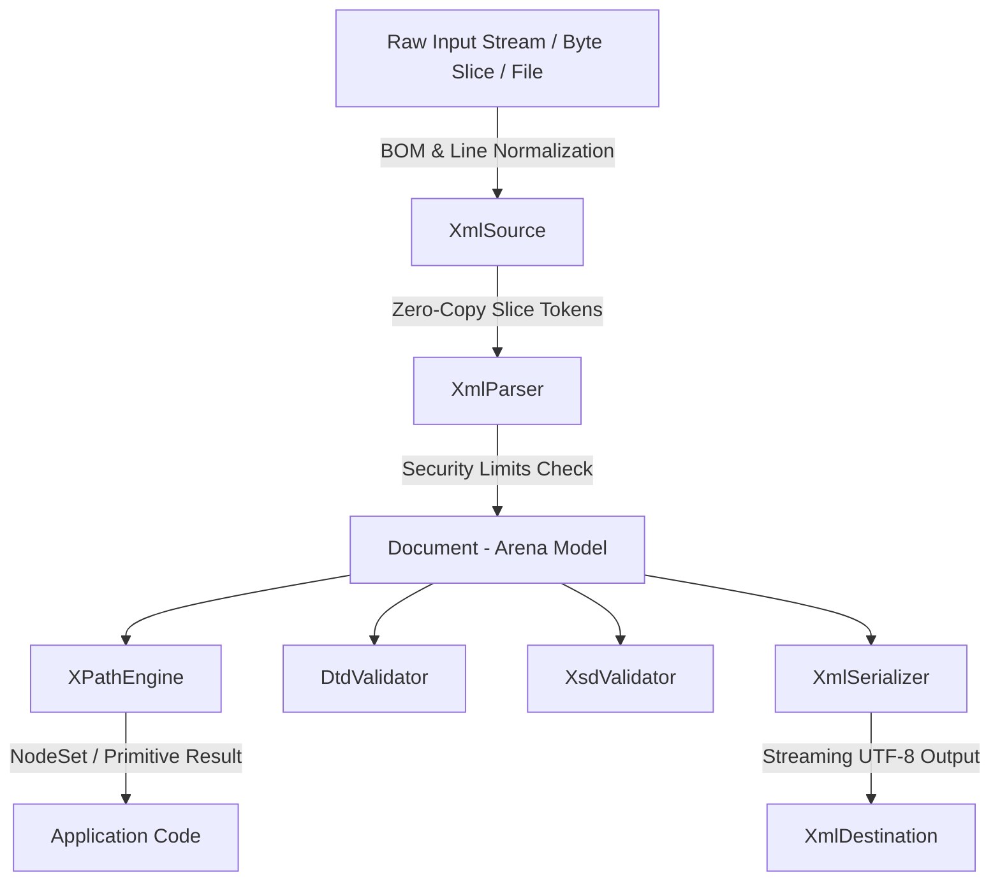

# Technical Architecture & Internal Design

This document details the internal design, memory layout, security enforcement model, and subsystem mechanics of the `xml_lib` Rust crate.

---

## 1. System Overview & Data Flow



---

## 2. Flat Arena Memory Model (`Document`)

Unlike traditional object-oriented DOM libraries that use heap-allocated pointer graphs (`Rc<RefCell<Node>>` or `Box<Node>`), `xml_lib` stores all DOM nodes in a flat contiguous arena vector: `Vec<NodeData>`.

### Key Benefits

1. **Compact 32-Bit Identifiers**: Every node is referenced by a `NodeId` (`u32`). Memory layout per node is reduced from 80 bytes to **32 bytes** on 64-bit systems.
2. **CPU Cache Line Efficiency**: Continuous memory layout allows CPU prefetchers to load multiple adjacent nodes into L1/L2 cache lines simultaneously.
3. **No Reference Cycles or Lifetimes**: Node linking (`parent`, `children`) uses simple integer indices, avoiding memory leaks or complex borrow checker lifetimes.

### Node Data Memory Layout

```rust
pub type NodeId = u32;

pub struct Attribute {
    pub name: Box<str>,   // 16 bytes (ptr + len)
    pub value: Box<str>,  // 16 bytes (ptr + len)
}

pub struct NodeData {
    pub id: NodeId,              // 4 bytes
    pub parent: Option<NodeId>,  // 8 bytes (discriminant + u32)
    pub children: Vec<NodeId>,   // 24 bytes (ptr + cap + len of u32)
    pub kind: NodeKind,          // Tag payload variant
}
```

---

## 3. Security Policy & XXE Safeguards (`ParseOptions`)

To defend against XML Denial of Service (DoS) and XML External Entity (XXE) attacks, `xml_lib` enforces strict resource thresholds at runtime:

```rust
pub struct ParseOptions {
    pub max_xml_size: usize,               // Default: 100 MB
    pub max_entity_expansion_depth: usize, // Default: 512 (Billion Laughs Guard)
    pub max_nesting_depth: usize,          // Default: 1000
    pub max_element_count: usize,          // Default: 1,000,000
    pub max_attribute_count: usize,        // Default: 10,000
    pub max_total_attribute_count: usize,  // Default: 1,000,000
    pub max_text_node_size: usize,         // Default: 1 MB
    pub allow_external_entities: bool,     // Default: false (XXE Guard)
}
```

### Protection Mechanisms

- **Billion Laughs / Entity Bomb Mitigation**: `EntityMapper` tracks expansion recursion depth. If nested entity replacements exceed `max_entity_expansion_depth`, an `XmlError::SecurityLimitExceeded` is returned immediately.
- **XXE Mitigation**: `allow_external_entities` defaults to `false`. Attempts to resolve external system entity URIs return security errors.
- **Nesting Stack Overflow Mitigation**: Parser tracks element depth during recursive tag parsing, stopping execution if nesting exceeds `max_nesting_depth`.

---

## 4. Subsystem Specifications

### A. Parser Engine (`XmlParser`)
- **Zero-Copy Scanning**: Operates on a UTF-8 string slice maintained by `XmlSource`. Tag names and attributes are tokenized via byte ranges and allocated into `Box<str>` in a single step.
- **Line Ending Normalization**: Automatically normalizes CRLF (`\r\n`) and legacy CR (`\r`) line breaks to standard `\n`.

### B. Serializer (`XmlSerializer`)
- **Allocation-Free Escaping**: Text and attribute character escaping (`&amp;`, `&lt;`, `&gt;`, `&quot;`) is streamed directly into `XmlDestination` without allocating temporary intermediate `String` instances.
- **Pretty Printing**: Configurable indentation depth (`indent_step`) with text node whitespace preservation.

### C. XPath 1.0 Subsystem (`XPathEngine`)
- **Lexer & Parser**: Recursive descent operator-precedence parser generating an `XPathExpr` AST.
- **13 Standard Axes**: Supports `child`, `descendant`, `parent`, `ancestor`, `following-sibling`, `preceding-sibling`, `following`, `preceding`, `attribute`, `namespace`, `self`, `descendant-or-self`, `ancestor-or-self`.
- **$O(N \log N)$ Deduplication**: Multi-step path evaluations and `|` union operations sort node sets in-place (`sort_unstable()`) and call `dedup()`, eliminating quadratic $O(N^2)$ search loops.
