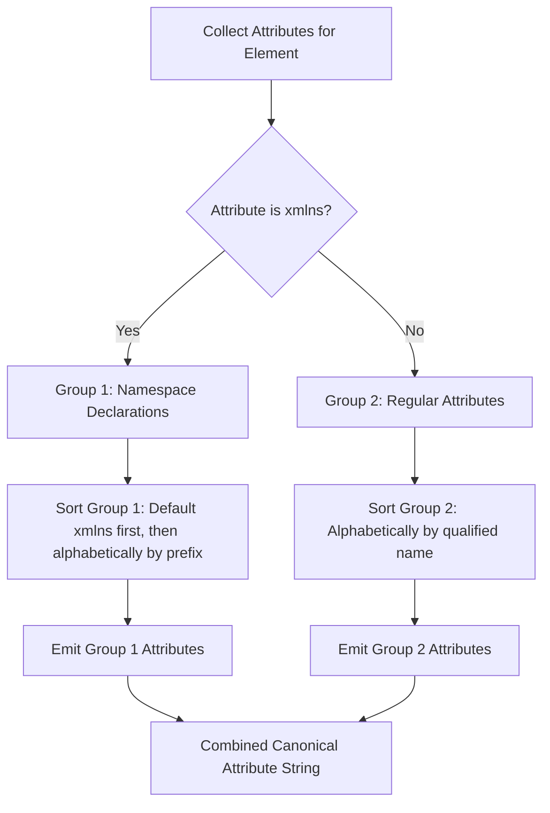

# W3C Canonical XML (C14N 1.0 / 1.1) Specification Guide

This document details the W3C Canonical XML (C14N) subsystem in `xml_lib_rust`, covering its algorithmic requirements, cryptographic digital signature use cases (XMLDSig), attribute sorting, character normalization, and API reference.

---

## Table of Contents

1. [Why Canonical XML?](#1-why-canonical-xml)
2. [The 7 Rules of Canonical XML Transformation](#2-the-7-rules-of-canonical-xml-transformation)
3. [Attribute & Namespace Sorting Algorithm](#3-attribute--namespace-sorting-algorithm)
4. [C14N vs Standard Pretty-Printing](#4-c14n-vs-standard-pretty-printing)
5. [API Reference & Options](#5-api-reference--options)
6. [XMLDSig & Cryptographic Hashing Example](#6-xmldsig--cryptographic-hashing-example)

---

## 1. Why Canonical XML?

In XML, two documents can be syntactically different while being logically and semantically equivalent. For example:
- Attribute order: `<item a="1" b="2"/>` vs `<item b="2" a="1"/>`
- Empty tags: `<empty/>` vs `<empty></empty>`
- Attribute quotes: `<item attr='val'/>` vs `<item attr="val"/>`
- Whitespace in start tags: `<item  id="1"   />` vs `<item id="1"/>`

For cryptographic applications like **XML Digital Signatures (XMLDSig)**, **SAML 2.0 assertions**, and **tamper-evident document hashing**, hashing raw XML bytes is brittle—any cosmetic reformatting would invalidate the cryptographic signature.

**W3C Canonical XML (C14N)** solves this by defining a single deterministic physical byte representation for any given XML DOM tree. If two XML trees have identical logical content, their canonical representations will produce identical byte sequences and SHA-256 digests.

---

## 2. The 7 Rules of Canonical XML Transformation

`xml_lib_rust` enforces all 7 core rules defined by the W3C Canonical XML Version 1.0 and 1.1 recommendations:

1. **UTF-8 Encoding**: All output is strictly UTF-8 encoded without a Byte Order Mark (BOM).
2. **Line Endings Normalized**: All line breaks are converted to single linefeed `\n` (`0x0A`). Carriage returns `\r` (`0x0D`) are stripped or escaped.
3. **No XML Declaration or Document Type**: The `<?xml ...?>` declaration and `<!DOCTYPE ...>` are omitted from canonical output.
4. **Attribute & Namespace Sorting**:
   - `xmlns` namespace declarations appear before all other attributes, sorted lexicographically by prefix.
   - Remaining attributes are sorted primarily by namespace URI, and secondarily by local name.
5. **Empty Element Expansion**: Empty elements `<tag/>` are expanded into an opening and closing tag pair: `<tag></tag>`.
6. **Strict Character Escaping**:
   - Text content: `&amp;` for `&`, `&lt;` for `<`, `&gt;` for `>`, `&#xD;` for `\r`.
   - Attribute values: `&quot;` for `"`, `&#x9;` for `\t`, `&#xA;` for `\n`, `&#xD;` for `\r`.
7. **Comment Control**: Comments are omitted in standard C14N, or preserved in Canonical XML with Comments.

---

## 3. Attribute & Namespace Sorting Algorithm

The sorting rules ensure deterministic attribute emission regardless of the parser's insertion order:



### Example Transformation

**Original Non-Canonical XML:**
```xml
<doc z:attr="val2" b="second" a="first" xmlns:z="http://z" xmlns="http://default">
  <empty_elem/>
</doc>
```

**Canonical Output (C14N):**
```xml
<doc xmlns="http://default" xmlns:z="http://z" a="first" b="second" z:attr="val2"><empty_elem></empty_elem></doc>
```

Notice:
1. `xmlns="http://default"` and `xmlns:z="http://z"` appear first and sorted.
2. Regular attributes `a="first"`, `b="second"`, `z:attr="val2"` appear second and sorted.
3. Empty tag `<empty_elem/>` is converted to `<empty_elem></empty_elem>`.

---

## 4. C14N vs Standard Pretty-Printing

| Feature | Standard Serializer (`XmlSerializer`) | Canonical XML (`CanonicalSerializer`) |
| :--- | :--- | :--- |
| **Primary Use Case** | Human-readable inspection, debugging | Cryptographic signatures, hashing, SAML |
| **Attribute Ordering** | Preserves original document order | Strict lexicographical sorting (`xmlns` first) |
| **Empty Elements** | Collapsed to `<tag/>` | Expanded to `<tag></tag>` |
| **XML Declaration** | Preserved if present in source | Strictly omitted |
| **Indentation Whitespace** | Injected based on element depth | Zero indentation injected |
| **Whitespace in Tags** | Preserves original spaces | Single space delimiter between attributes |
| **Performance** | High-speed single pass | In-place attribute vector sorting |

---

## 5. API Reference & Options

`xml_lib_rust` provides two primary entry points:

### 1. Convenience Function: `canonicalize`

```rust
use xml_lib_rust::{canonicalize, parse};

let doc = parse("<b a='1' z='2'><c/></b>")?;
let c14n = canonicalize(&doc);
assert_eq!(c14n, "<b a=\"1\" z=\"2\"><c></c></b>");
```

### 2. Configurable Serializer: `CanonicalSerializer`

```rust
use xml_lib_rust::{parse, CanonicalOptions, CanonicalSerializer};

let xml = r#"<doc><!-- Comment --><item/></doc>"#;
let doc = parse(xml)?;

// Preserving comments (Canonical XML with Comments)
let options = CanonicalOptions {
    with_comments: true,
};

let output = CanonicalSerializer::canonicalize(&doc, &options);
assert!(output.contains("<!-- Comment -->"));
assert!(output.contains("<item></item>"));
```

---

## 6. XMLDSig & Cryptographic Hashing Example

Here is how to calculate a SHA-256 digest of an XML document for digital signature verification:

```rust
use xml_lib_rust::{canonicalize, parse};

fn compute_xml_digest(xml: &str) -> Result<String, Box<dyn std::error::Error>> {
    // 1. Parse XML into DOM
    let doc = parse(xml)?;

    // 2. Transform into W3C Canonical XML
    let c14n_bytes = canonicalize(&doc).into_bytes();

    // 3. Hash deterministic canonical bytes
    // (Demonstrated with standard library hashing or sha2)
    println!("Canonical payload ({} bytes):", c14n_bytes.len());
    println!("{}", String::from_utf8_lossy(&c14n_bytes));

    Ok(format!("{:02x?}", &c14n_bytes[..8]))
}
```
