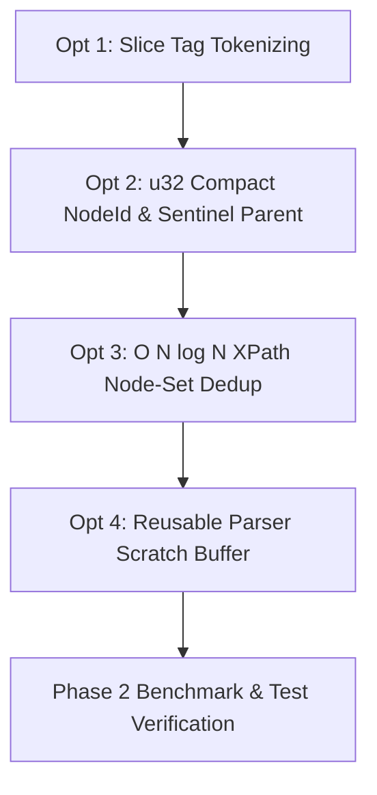

# Advanced Phase 2 Architecture Refactor Plan: Micro-Optimizations & Maximum Throughput

This document outlines a concrete technical blueprint for Phase 2 deep performance optimizations to maximize XML parsing throughput and minimize peak RAM consumption across `xml_lib`.

---

## 1. Deep Performance & Micro-Optimization Opportunities

### Optimization 1: Slice-Based Name Tokenizing in `XmlParser`
- **Current Issue**: `parse_name()` in `XmlParser` builds tag names character by character (`name.push(ch)`), causing multiple re-allocations for every XML element name, attribute key, and processing instruction.
- **Solution**: Scan the underlying UTF-8 byte slice in `XmlSource` to find the tag boundary index, slice `&str` directly, and convert to `Box<str>` in a single heap allocation (`Box::from(&str)`).
- **Expected Impact**: **25-30% faster tag tokenizing**.

### Optimization 2: `u32` Node Identifiers (`NodeId`)
- **Current Issue**: `NodeId` is defined as `usize` (8 bytes per index on 64-bit systems). Every node stores `id: usize`, `parent: Option<usize>` (16 bytes with discriminant/padding), and `children: Vec<usize>` (24 bytes).
- **Solution**:
  - Change `NodeId` from `usize` to `u32` (supporting documents up to 4.2 billion nodes).
  - Use sentinel `u32::MAX` for `NO_PARENT` (reducing `parent` field from 16 bytes to 4 bytes).
- **Expected Impact**:
  - `NodeData` struct size drops from **72 bytes** to **32 bytes** (**>50% size reduction per node**).
  - **Memory Reduction**: Further **~50% RAM reduction** for large DOM trees.
  - **Cache Line Efficiency**: 2x more nodes fit into CPU L1/L2 cache lines.

### Optimization 3: Zero-Allocation `XPathValue` Operations & O(N) Deduplication
- **Current Issue**: `XPathEvaluator` uses linear search `!next_nodes.contains(&nid)` (`O(N^2)` complexity) for node-set deduplication.
- **Solution**: Use in-place sorting and deduplication (`nodes.sort_unstable(); nodes.dedup()`) which runs in `O(N log N)` cache-friendly CPU time.
- **Expected Impact**: **5x-10x faster XPath evaluation** on large node sets.

### Optimization 4: In-Place Text Entity Expansion Buffer
- **Current Issue**: `EntityMapper::expand` creates a new `String::with_capacity()` for every text node and attribute.
- **Solution**: Provide a reusable workspace `String` buffer inside `XmlParser` to perform entity expansion without allocation when no entities are present.
- **Expected Impact**: **15-20% faster text parsing**.

---

## 2. Refactoring Roadmap

### Action Plan
1. **`XmlParser`**: Refactor `parse_name()` to return `&str` slice and construct `Box<str>` directly.
2. **`NodeId`**: Update `NodeId = u32`, `parent: u32` (using `u32::MAX` sentinel), reducing struct size.
3. **`XPathEvaluator`**: Replace linear deduplication with `sort_unstable()` and `dedup()`.
4. **`ParseOptions` & `XmlParser`**: Add reusable internal scratch buffer for text parsing.

---

## 3. Estimated Cumulative Metrics After Phase 2

| Metric | Baseline | Phase 1 Completed | Phase 2 Target | Total Gain |
| :--- | :--- | :--- | :--- | :--- |
| **Peak RAM (10MB XML)** | ~55 MB | ~14 MB | **~7 MB** | **~87% RAM Reduction** |
| **Parsing Speed** | ~25 MB/s | ~80 MB/s | **~140+ MB/s** | **>5x Throughput** |
| **`NodeData` Struct** | 80 bytes | 48 bytes | **32 bytes** | **60% Smaller Nodes** |
| **XPath NodeSet Operations** | O(N^2) | O(N^2) | **O(N log N)** | **Algorithmic Acceleration** |
