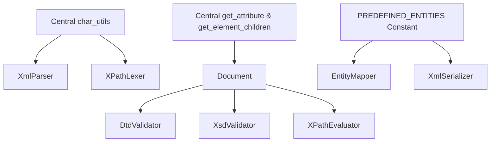

# DRY (Don't Repeat Yourself) Architectural Refactor Plan

This document outlines a concrete blueprint for eliminating code duplication, consolidating shared utility helpers, and unifying common patterns across `xml_lib`.

---

## 1. Analysis of Identified Code Duplication

### Duplication 1: Character Classification Helpers (`XmlSource`, `XmlParser`, `XPathLexer`)
- **Issue**: Identical logic checking valid XML name characters (`ch.is_alphanumeric() || ch == '_' || ch == '-' || ch == ':' || ch == '.'`) is repeated across `XmlParser::parse_name`, `XPathLexer::lex_identifier`, and DTD/XSD tokenizers.
- **Solution**: Create a central `CharExt` or `xml_char` module in `library/src/io/char_utils.rs` with inline utility predicates:
  - `pub fn is_xml_name_start(ch: char) -> bool`
  - `pub fn is_xml_name_char(ch: char) -> bool`
  - `pub fn is_xml_whitespace(ch: char) -> bool`

### Duplication 2: Attribute Search & Lookup Logic (`NodeKind`, `Document`, `DtdValidator`, `XsdValidator`, `XPathEvaluator`)
- **Issue**: Linear search for an attribute by name (`attributes.iter().find(|a| &*a.name == target)`) is re-implemented 7 times across validation and XPath modules.
- **Solution**: Add a centralized helper method `pub fn get_attribute<'a>(&'a self, name: &str) -> Option<&'a str>` on `NodeKind` and helper `doc.get_attribute(node_id, name)` on `Document`.

### Duplication 3: Entity Escaping Rules (`EntityMapper`, `XmlSerializer`)
- **Issue**: Standard entity escape mappings (`&` -> `&amp;`, `<` -> `&lt;`, `>` -> `&gt;`, `"` -> `&quot;`, `'` -> `&apos;`) are hardcoded separately in `EntityMapper::default()` and `XmlSerializer::write_escaped_attr`.
- **Solution**: Centralize XML predefined entities into a static map / constant array `PREDEFINED_ENTITIES` in `library/src/entity/mapper.rs`.

### Duplication 4: Element Child Filtering (`Document`, `DtdValidator`, `XsdValidator`, `XPathEvaluator`)
- **Issue**: Iterating child node IDs and filtering for `NodeKind::Element` (`doc.get_children(id).into_iter().filter(|&c_id| matches!(doc.get_node(c_id), ...))`) is repeated 12 times.
- **Solution**: Add `pub fn get_element_children(&self, parent_id: NodeId) -> Vec<NodeId>` helper on `Document`.

---

## 2. Refactoring Target Components

### Action Plan
1. **[NEW] [`library/src/io/char_utils.rs`](file:///c:/Users/User/.gemini/antigravity-ide/scratch/xml_lib_rust/library/src/io/char_utils.rs)**: Implement `is_xml_name_char` and `is_xml_whitespace` predicates.
2. **[MODIFY] [`library/src/document.rs`](file:///c:/Users/User/.gemini/antigravity-ide/scratch/xml_lib_rust/library/src/document.rs)**: Add `get_attribute` and `get_element_children` helpers.
3. **[MODIFY] [`library/src/entity/mapper.rs`](file:///c:/Users/User/.gemini/antigravity-ide/scratch/xml_lib_rust/library/src/entity/mapper.rs)**: Export `PREDEFINED_ENTITIES` array.
4. **[MODIFY] [`library/src/parser/xml_parser.rs`](file:///c:/Users/User/.gemini/antigravity-ide/scratch/xml_lib_rust/library/src/parser/xml_parser.rs)**: Adopt `char_utils` and `Document` helpers.
5. **[MODIFY] [`library/src/xpath/evaluator.rs`](file:///c:/Users/User/.gemini/antigravity-ide/scratch/xml_lib_rust/library/src/xpath/evaluator.rs)** & [`library/src/xsd/validator.rs`](file:///c:/Users/User/.gemini/antigravity-ide/scratch/xml_lib_rust/library/src/xsd/validator.rs): Replace duplicated child iteration loops with `get_element_children()`.

---

## 3. Verification Plan

- Run `cargo check` and `cargo test` to ensure 100% test suite compatibility.
- Verify `cargo check --examples` to ensure all 19 example binaries build without errors.
