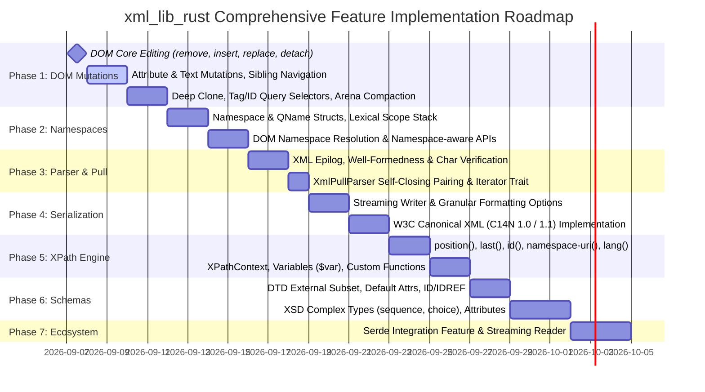

# Comprehensive Refactor & Feature Expansion Plan: `xml_lib_rust`

This document details the architectural analysis, gap assessment, and phased engineering roadmap to bring `xml_lib_rust` to feature parity with modern, production-grade XML processing systems (such as `libxml2`, W3C DOM Core Level 1–3, XML Namespaces 1.0, W3C XPath 1.0 Full Standard, and W3C Canonical XML C14N).

---

## 1. Executive Summary & Specification Gap Analysis

While `xml_lib_rust` provides a solid arena-backed DOM, zero-allocation pull parser, XPath 1.0 core engine, and basic DTD/XSD validators, an in-depth audit reveals key functional gaps across eight foundational domains:

| Domain | Current Implementation | Missing Standard Features | Specification Target |
|---|---|---|---|
| **DOM Manipulation** | Append-only arena (`append_child`), basic getters | Node deletion (`remove_child`), insertion (`insert_before`), node replacement (`replace_child`), deep cloning (`clone_node`), attribute mutations (`set_attribute`, `remove_attribute`), sibling/child navigation, element search by tag/ID, arena compaction | W3C DOM Level 1, 2 & 3 Core |
| **XML Namespaces** | Opaque prefixed strings (`"xs:element"`) | Namespace resolution stack, `QName` prefix/URI separation, default namespace inheritance, scope management, namespace lookup APIs | W3C Namespaces in XML 1.0 / 1.1 |
| **Parser Engine** | Declaration, Prolog, Single Element tree | XML Epilog support (trailing comments/PIs), XML 1.0 character validity enforcement, single root enforcement, attribute value normalization, streaming `io::Read` decoding | W3C XML 1.0 (Fifth Edition) |
| **Streaming Pull Parser** | Basic tag/text/comment events | Self-closing tag pairing (`EndElement`), DOCTYPE & Declaration pull events, EndDocument event, standard Rust `Iterator` trait implementation | Streaming StAX / SAX Model |
| **Serialization & C14N** | String-only serializer with basic indentation | Streaming writer (`std::io::Write`), Canonical XML (C14N 1.0 / 1.1), configurable quotes, declaration omission, self-close flags | W3C Canonical XML (C14N) |
| **XPath 1.0 Engine** | 22 built-in functions, 13 axes | `position()`, `last()`, `id()`, `namespace-uri()`, `lang()`, dynamic context with variable bindings (`$var`), user-defined custom functions, XPath 2.0 string extensions | W3C XPath 1.0 Recommendation |
| **Schema Validation** | Simple DTD content models, basic XSD restriction facets | DTD external subset resolution, attribute default injection, ID/IDREF integrity; XSD complex types (`sequence`, `choice`, `all`), attributes, global types, temporal datatypes | W3C XML Schema 1.0 & DTD Spec |
| **Ecosystem & IO** | UTF-8/UTF-16 BOM, static memory buffers | Optional `serde` integration (`from_str`, `to_string`), ISO-8859-1 / Windows-1252 encodings, streaming `io::Read` source, safe sandboxed `FileEntityResolver` | Rust Ecosystem Standards |

---

## 2. Detailed Technical Plan by Subsystem

### Phase 1: W3C DOM Core Mutations & Traversal API

#### 1.1 Problem Statement
Currently, `Document` only permits creating nodes via `add_node()` and appending them via `append_child()`. Once a tree is created, it cannot be dynamically edited, reordered, pruned, or cloned.

#### 1.2 Proposed Changes
In [`library/src/document.rs`](file:///c:/Users/User/.gemini/antigravity-ide/scratch/xml_lib_rust/library/src/document.rs) and [`library/src/node.rs`](file:///c:/Users/User/.gemini/antigravity-ide/scratch/xml_lib_rust/library/src/node.rs):

1. **Child Node Mutations**:
   - `remove_child(&mut self, parent_id: NodeId, child_id: NodeId) -> Result<NodeId>`:
     - Removes `child_id` from `nodes[parent_id].children`.
     - Clears `nodes[child_id].parent = None`.
   - `insert_before(&mut self, parent_id: NodeId, new_child: NodeId, ref_child: NodeId) -> Result<()>`:
     - Finds position of `ref_child` in `children` vector and inserts `new_child` immediately prior.
     - Updates `parent` link on `new_child`.
   - `replace_child(&mut self, parent_id: NodeId, new_child: NodeId, old_child: NodeId) -> Result<()>`:
     - Swaps `old_child` with `new_child` in `children` vector.
     - Unlinks `old_child.parent = None`, links `new_child.parent = Some(parent_id)`.
   - `detach(&mut self, node_id: NodeId) -> Result<()>`:
     - Detaches node from its current parent if one exists.

2. **Attribute & Text Node Mutations**:
   - `set_attribute(&mut self, elem_id: NodeId, name: impl Into<Box<str>>, value: impl Into<Box<str>>) -> Result<()>`:
     - Updates existing attribute in-place or appends a new [`Attribute`](file:///c:/Users/User/.gemini/antigravity-ide/scratch/xml_lib_rust/library/src/node.rs#L13).
   - `remove_attribute(&mut self, elem_id: NodeId, name: &str) -> bool`:
     - Deletes matching attribute, returning `true` if found.
   - `has_attribute(&self, elem_id: NodeId, name: &str) -> bool`
   - `set_text_content(&mut self, node_id: NodeId, text: &str) -> Result<()>`:
     - For elements: removes existing child text nodes and appends a single new `NodeKind::Text`.
     - For text/CDATA/comment nodes: updates content in-place.

3. **DOM Traversal & Navigation**:
   - `first_child(&self, id: NodeId) -> Option<NodeId>`
   - `last_child(&self, id: NodeId) -> Option<NodeId>`
   - `next_sibling(&self, id: NodeId) -> Option<NodeId>`
   - `previous_sibling(&self, id: NodeId) -> Option<NodeId>`
   - `first_element_child(&self, id: NodeId) -> Option<NodeId>`
   - `last_element_child(&self, id: NodeId) -> Option<NodeId>`

4. **Cloning & Queries**:
   - `clone_node(&mut self, node_id: NodeId, deep: bool) -> Result<NodeId>`:
     - Recursively duplicates subtree nodes into new arena slots, preserving structure and attributes without parent linkage.
   - `get_elements_by_tag_name(&self, name: &str) -> Vec<NodeId>`:
     - Traverses element hierarchy and collects all matching tag names (supports `"*"` wildcard).
   - `get_element_by_id(&self, id: &str) -> Option<NodeId>`:
     - Looks up element matching `id="..."` attribute.

5. **Arena Compaction & Garbage Collection**:
   - `compact(&mut self) -> Result<()>`:
     - Reclaims unreferenced nodes in the arena vector and re-maps all internal `NodeId` indices, minimizing memory fragmentation after heavy editing.

---

### Phase 2: First-Class XML Namespaces Subsystem

#### 2.1 Problem Statement
Currently, tag names and attributes are treated as literal strings (e.g. `"xs:element"`, `"xmlns:env"`). The parser lacks awareness of prefix bindings, scope hierarchy, default namespaces, or URI resolution.

#### 2.2 Proposed Architecture
Introduce a new submodule `library/src/namespace/`:
- `Namespace`:
  ```rust
  #[derive(Debug, Clone, PartialEq, Eq)]
  pub struct Namespace {
      pub prefix: Option<Box<str>>,
      pub uri: Box<str>,
  }
  ```
- `QName`:
  ```rust
  #[derive(Debug, Clone, PartialEq, Eq)]
  pub struct QName {
      pub prefix: Option<Box<str>>,
      pub local_name: Box<str>,
      pub namespace_uri: Option<Box<str>>,
  }
  ```
- `NamespaceScope`:
  - Maintains a stacked lexical scope during parsing and evaluation.
  - Resolves prefixes to URIs, handles `xmlns="..."` default scoping and prefix shadowing.

#### 2.3 Integration Points
- Update [`NodeKind::Element`](file:///c:/Users/User/.gemini/antigravity-ide/scratch/xml_lib_rust/library/src/node.rs#L45) and [`Attribute`](file:///c:/Users/User/.gemini/antigravity-ide/scratch/xml_lib_rust/library/src/node.rs#L13) to store or resolve `QName` and active namespace bindings.
- Add DOM namespace queries on `Document`:
  - `get_namespace_uri(&self, id: NodeId) -> Option<&str>`
  - `get_prefix(&self, id: NodeId) -> Option<&str>`
  - `get_local_name(&self, id: NodeId) -> &str`
  - `lookup_prefix(&self, id: NodeId, uri: &str) -> Option<String>`
  - `lookup_namespace_uri(&self, id: NodeId, prefix: &str) -> Option<String>`
  - `get_elements_by_tag_name_ns(&self, uri: &str, local_name: &str) -> Vec<NodeId>`

---

### Phase 3: Parser Epilog, Well-Formedness & Streaming Pull Parser

#### 3.1 XML Epilog & Well-Formedness Guards
In [`library/src/parser/xml_parser.rs`](file:///c:/Users/User/.gemini/antigravity-ide/scratch/xml_lib_rust/library/src/parser/xml_parser.rs):
1. **Epilog Parsing**:
   - XML 1.0 allows comments, processing instructions, and whitespace after the root element closing tag (`</root>`).
   - Add `parse_epilog(&mut doc)` to consume trailing comments and PIs, attaching them to the root container node.
2. **Single Root Element Rule**:
   - Ensure that having a second element tag after the root closing tag triggers `XmlError::SyntaxError("Multiple root elements forbidden in well-formed XML")`.
3. **Invalid XML Character Validation**:
   - In [`char_utils.rs`](file:///c:/Users/User/.gemini/antigravity-ide/scratch/xml_lib_rust/library/src/io/char_utils.rs), add `is_valid_xml_char(c: char) -> bool` to reject forbidden control characters (`0x00..=0x08`, `0x0B..=0x0C`, `0x0E..=0x1F`).
4. **Attribute Value Normalization**:
   - Normalize tabs, newlines, and carriage returns in attribute values to spaces according to XML 1.0 §3.3.3.

#### 3.2 Streaming Pull Parser (`XmlPullParser`) Enhancements
In [`library/src/parser/pull_parser.rs`](file:///c:/Users/User/.gemini/antigravity-ide/scratch/xml_lib_rust/library/src/parser/pull_parser.rs):
1. **Self-Closing Tag Pairing**:
   - When encountering an empty element `<item attr="val"/>`, save state and emit `StartElement`, then immediately emit `EndElement` on the subsequent call.
2. **New Pull Events**:
   - `XmlPullEvent::Declaration { version: &'a str, encoding: Option<&'a str>, standalone: Option<bool> }`
   - `XmlPullEvent::DocType { name: &'a str, public_id: Option<&'a str>, system_id: Option<&'a str> }`
   - `XmlPullEvent::EndDocument`
3. **Idiomatic Iterator Implementation**:
   - Implement `core::iter::Iterator` for `XmlPullParser<'a>` yielding `Result<XmlPullEvent<'a>>`.

---

### Phase 4: Advanced Serialization, Streaming Writer & Canonical XML (C14N)

#### 4.1 Streaming Writer & Options
In [`library/src/stringify/serializer.rs`](file:///c:/Users/User/.gemini/antigravity-ide/scratch/xml_lib_rust/library/src/stringify/serializer.rs):
1. **Streaming Output Support**:
   - Add `serialize_to_writer<W: std::io::Write>(doc: &Document, writer: &mut W, options: &SerializeOptions) -> std::io::Result<()>`.
   - Add `serialize_to_fmt<W: core::fmt::Write>(doc: &Document, writer: &mut W, options: &SerializeOptions) -> core::fmt::Result` for `#![no_std]` environments.
2. **Expanded `SerializeOptions`**:
   ```rust
   pub struct SerializeOptions {
       pub pretty_print: bool,
       pub indent_step: usize,
       pub omit_xml_declaration: bool,
       pub quote_char: char,               // '"' or '\''
       pub line_ending: LineEnding,         // Lf or CrDr
       pub self_close_empty: bool,          // <tag/> vs <tag></tag>
   }
   ```

#### 4.2 W3C Canonical XML (C14N 1.0 & 1.1)
Implement a dedicated `CanonicalSerializer`:
- Sort element attributes in lexicographical order: first by namespace URI, then by local name.
- Standardize empty elements to `<elem></elem>` (no self-closing `<elem/>`).
- Strict character escaping: `&amp;`, `&lt;`, `&gt;`, `&quot;`, `&#xD;`.
- Omit XML declaration and normalize all line breaks to `\n`.
- Essential for XML Digital Signatures (XML-DSig) and reproducible document hashing.

---

### Phase 5: Complete XPath 1.0 Standard & Function Library

#### 5.1 Missing Core XPath 1.0 Functions
In [`library/src/xpath/evaluator.rs`](file:///c:/Users/User/.gemini/antigravity-ide/scratch/xml_lib_rust/library/src/xpath/evaluator.rs):
1. **Context State Functions**:
   - `position()`: Returns the 1-based index of the context node within the evaluated context node-set.
   - `last()`: Returns the total count of nodes in the current context node-set.
   - Enables core expressions like: `//book[position() = 1]`, `//chapter[last()]`, `//item[position() <= 5]`.
2. **Node Identifier & Language Functions**:
   - `id(arg)`: Resolves elements by unique `id` attribute.
   - `namespace-uri(node-set?)`: Returns the namespace URI of the target node.
   - `lang(string)`: Checks if the context node has an `xml:lang` matching the argument.

#### 5.2 Dynamic XPath Context & Variable Bindings
- Introduce `XPathContext`:
  ```rust
  pub struct XPathContext<'a> {
      pub doc: &'a Document,
      pub variables: HashMap<String, XPathValue>,
      pub namespaces: HashMap<String, String>,
      pub custom_functions: HashMap<String, Box<dyn Fn(&[XPathValue]) -> Result<XPathValue>>>,
  }
  ```
- Resolve variable references like `$limit`, `$category` in XPath expressions.
- Allow users to register custom XPath functions: `context.register_function("custom_fn", ...)`.

#### 5.3 Modern XPath 2.0 / 3.0 Convenience Functions
Add high-demand utility functions:
- `ends-with(s1, s2)`
- `lower-case(s)`, `upper-case(s)`
- `replace(input, pattern, replacement)`
- `matches(input, pattern)`

---

### Phase 6: Schema Validation Expansion (DTD & XSD)

#### 6.1 DTD Enhancements
In [`library/src/dtd/validator.rs`](file:///c:/Users/User/.gemini/antigravity-ide/scratch/xml_lib_rust/library/src/dtd/validator.rs):
1. **External DTD Subset Resolution**:
   - Integrate with [`EntityResolver`](file:///c:/Users/User/.gemini/antigravity-ide/scratch/xml_lib_rust/library/src/entity/resolver.rs#L9) to load external DTD files (`SYSTEM "rules.dtd"`).
2. **Default Attribute Injection**:
   - When an attribute is declared with a default value (`<!ATTLIST elem attr CDATA "default_val">`), populate missing attributes on elements during validation or parsing.
3. **ID / IDREF Constraint Enforcement**:
   - Validate that `ID` attribute values are unique across the document and all `IDREF` values point to existing `ID`s.

#### 6.2 XSD Schema Enhancements
In [`library/src/xsd/validator.rs`](file:///c:/Users/User/.gemini/antigravity-ide/scratch/xml_lib_rust/library/src/xsd/validator.rs):
1. **Complex Type Validation**:
   - Parse and enforce `<xs:complexType>`, `<xs:sequence>`, `<xs:choice>`, and `<xs:all>`.
   - Validate child element ordering and multiplicity bounds (`minOccurs`, `maxOccurs`).
2. **Attribute Constraints**:
   - Validate `<xs:attribute name="..." type="..." use="required|optional"/>`.
3. **Expanded Primitive Types**:
   - Built-in validation for: `xs:date`, `xs:dateTime`, `xs:time`, `xs:decimal`, `xs:float`, `xs:double`, `xs:anyURI`, `xs:QName`.
4. **Global Type References**:
   - Support named `<xs:simpleType name="...">` definitions referenced across multiple elements.

---

### Phase 7: Ecosystem Integrations (Serde, IO & Encodings)

#### 7.1 Optional Serde Feature (`serde`)
- Add `[features] serde = ["dep:serde"]` in `library/Cargo.toml`.
- Provide high-level serialization and deserialization APIs:
  - `xml_lib_rust::from_str<T: serde::de::DeserializeOwned>(xml: &str) -> Result<T>`
  - `xml_lib_rust::to_string<T: serde::Serialize>(val: &T) -> Result<String>`
- Maps Rust structs, enums, primitives, and sequences directly to XML elements and attributes.

#### 7.2 Streaming Source & Additional Encodings
- Add `XmlSource::from_reader<R: std::io::Read>(reader: R) -> Result<Self>` for streaming chunked parsing of multi-gigabyte files.
- Support legacy byte encodings: ISO-8859-1 (Latin1), Windows-1252, and ASCII.
- Safe `FileEntityResolver`: Built-in path-checked file resolver for local XML catalogs without network exposure.

---

## 3. Implementation Roadmap & Milestones



---

## 4. Verification & Testing Strategy

1. **Unit & Regression Testing**:
   - Maintain 100% pass rate on all existing 73 integration tests across 15 test modules.
   - Add dedicated test modules for each new subsystem:
     - `tests/dom_mutations.rs`: node removal, insertion, replacement, deep cloning, and compaction.
     - `tests/namespaces.rs`: namespace prefix resolution, default namespaces, and qualified queries.
     - `tests/xml_epilog.rs`: trailing comments, PIs, and multiple root rejection.
     - `tests/pull_iterator.rs`: pull parser iteration and self-closing tag pairing.
     - `tests/canonical_xml.rs`: W3C C14N test suite vectors and digital signature serialization.
     - `tests/xpath_advanced.rs`: `position()`, `last()`, variable bindings, and custom functions.
     - `tests/xsd_complex_types.rs`: element sequence and choice validation.
     - `tests/serde_integration.rs`: struct and enum serialization/deserialization.
2. **Specification Conformance**:
   - Verify compliance against W3C XML 1.0 (5th Edition), Namespaces in XML 1.0, and XPath 1.0 test suites.
3. **Embedded & `#![no_std]` Verification**:
   - `cargo check --no-default-features --features alloc`
   - `cargo check --features small_nodes`
4. **Documentation & Examples**:
   - Zero warnings on `cargo doc --no-deps`.
   - Update [`docs/API_GUIDE.md`](file:///c:/Users/User/.gemini/antigravity-ide/scratch/xml_lib_rust/docs/API_GUIDE.md) and [`docs/ARCHITECTURE.md`](file:///c:/Users/User/.gemini/antigravity-ide/scratch/xml_lib_rust/docs/ARCHITECTURE.md) with comprehensive guides for all new capabilities.
