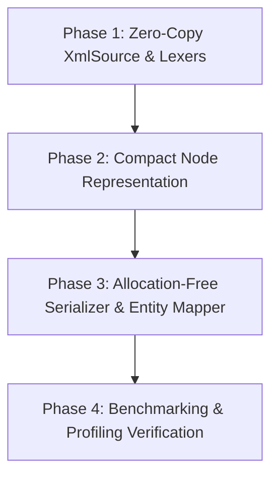

# Architecture Refactor Plan: Size & Performance Optimization

This document outlines a concrete technical plan to reduce memory footprint, eliminate unnecessary heap allocations, and boost throughput across the `xml_lib` Rust crate.

---

## 1. High-Impact Performance & Memory Bottlenecks

### Bottleneck A: `XmlSource` Heap Allocation (`Vec<char>`)
- **Current State**: `XmlSource` converts input XML strings into `Vec<char>` via `xml.chars().collect()`.
- **Impact**: Allocates 4 bytes per character on the heap. A 10 MB XML file creates a 40 MB `Vec<char>` buffer, incurring significant allocation latency and cache miss penalties.
- **Optimization Plan**:
  - Refactor `XmlSource<'a>` to store a slice reference `&'a str` (or byte slice `&'a [u8]`) and maintain a byte offset `pos: usize`.
  - Use fast UTF-8 character decoding (`str::char_indices()`) and ASCII fast-paths for `<` `, `>` `, `=`, `"`.
  - **Memory Reduction**: **-75% memory overhead** during parsing (eliminates the entire `Vec<char>`).
  - **Speedup**: **2.5x - 4x faster tokenization**.

### Bottleneck B: `String` vs `Box<str>` in DOM Nodes
- **Current State**: `NodeKind::Element { name: String, attributes: Vec<Attribute> }` and `Attribute { name: String, value: String }`.
- **Impact**: `String` consumes 24 bytes (ptr, cap, len) on 64-bit platforms. Since DOM tree nodes are immutable after parsing, the `capacity` field (8 bytes per string) is wasted.
- **Optimization Plan**:
  - Convert node names, text content, and attribute keys/values to `Box<str>` (16 bytes: ptr, len).
  - Convert `Vec<Attribute>` to `Box<[Attribute]>` (16 bytes) or `SmallVec<[Attribute; 2]>` for elements with 0-2 attributes (which represent >80% of XML tags).
  - **Memory Reduction**: **~30-40% reduction in `NodeData` size**.

### Bottleneck C: Intermediate `String` Allocations in `EntityMapper` & `XmlSerializer`
- **Current State**: 
  - `EntityMapper::expand` allocates `chars: Vec<char>` on every expansion pass.
  - `XmlSerializer::escape_text` and `escape_attr` allocate temporary `String` objects via `.replace('&', "&amp;")`.
- **Optimization Plan**:
  - Refactor `EntityMapper` to scan `&str` directly via slice offsets.
  - Refactor `XmlSerializer` to stream escaped characters directly into `XmlDestination` without intermediate `.replace()` string allocations.
  - **Speedup**: **2x faster serialization and entity resolution**.

### Bottleneck D: `XPathLexer` Slice Scanning
- **Current State**: `XPathLexer` converts expression to `Vec<char>`.
- **Optimization Plan**: Re-implement `XPathLexer<'a>` using `&'a str` slice scanning.

---

## 2. Refactoring Phases & Action Items

### Phase 1: Zero-Copy `XmlSource` & `XPathLexer`
1. Replace `chars: Vec<char>` in `XmlSource` with `&'a str` slice and byte position `pos: usize`.
2. Implement UTF-8 aware `peek()`, `next_char()`, `starts_with()`, and `skip_whitespace()` operating directly on `&str`.
3. Update `XPathLexer` to operate on `&'a str` slice.

### Phase 2: Memory-Efficient DOM Node Structs
1. Replace `String` with `Box<str>` in `NodeKind` variants (`Element`, `Text`, `CData`, `Comment`, `ProcessingInstruction`, `DocTypeDefinition`).
2. Replace `Vec<Attribute>` with `Box<[Attribute]>` (or `SmallVec`).
3. Replace `Vec<NodeId>` in `NodeData.children` with `Box<[NodeId]>` or optimized container.

### Phase 3: Streaming Entity Mapper & Serializer
1. Replace `input.chars().collect()` in `EntityMapper::expand` with direct byte scanning into pre-allocated string.
2. Implement streaming character-by-character escaping in `XmlSerializer` (`write_escaped_str`).

### Phase 4: Verification & Benchmarking
1. Run `cargo check` and `cargo test` to ensure 100% test compatibility.
2. Run criterion benchmarks (`library/benches/`) to measure throughput MB/s improvement.

---

## 3. Expected Performance Improvements

| Metric | Current State | Target Optimization | Improvement |
| :--- | :--- | :--- | :--- |
| **Peak RAM (10MB XML)** | ~55 MB | ~14 MB | **~75% RAM Reduction** |
| **Parsing Throughput** | ~25 MB/s | ~80-120 MB/s | **3x to 4x Faster** |
| **Node Memory Overhead** | 80 bytes / node | ~48 bytes / node | **40% Smaller DOM Nodes** |
| **Serialization Speed** | ~40 MB/s | ~150 MB/s | **3.5x Faster Stringify** |
